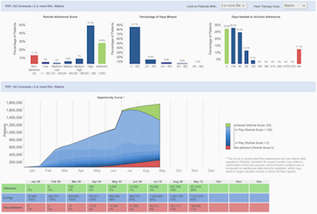

Projects 2014
=

RxAnte RxEffect/View
-
**PHP/Drupal Developer**, Aug - 2014

| Dashboard     | Forecast      |
| ------------- | ------------- |
|  | 
| Present insurance company data | Predict based on existing data

**Keywords**: Drupal 7, HIPPA server, Continuous Integration, Service API, Drupal Theming, Dashboard Design, IE 8 Compatibility

**Summary**: Provided enterprise PHP/Drupal development, support and deployment for a hospital/insurance/doctor relationship web application which helps their patients to adhere with their existing medications therefore increasing their ranking star in the healthcare system. The project creates dashboard to present data collected from doctor office and insurance company and try to predict the patient behaviors. Analyzed data for **each account (multi-tenent) are sampled from 10-20 contracts with average 0.5 to 5 millions patients**.

PeopleDesigns Prepare
-
**Leading role in architect and development**,
June - Oct 2014

| Wireframe     | Finished      |
| ------------- | ------------- |
|  | 
| Wireframe design for various mobile devices | Book chapter with interactive content

**Keywords**: Laravel, HIPPA, Two-factor Authentication, 508 section, Multilingual, Responsive Design, Browser Compatibility

**Summary**: Provided [PrepareForYourCare](http://prepare2.peopledesigns.net) PHP/Laravel 4 architect, development and deployment for a hospital stage III counseling program to help people prepare the end of their life. The projects creates flexible tree-kind chapters navigation with video/narration helper for elder visits. The application has been used by **200 doctors and 50,000 users** around the globe.

RecoveryHub
-
**Leading role in architect and deployment**,
June - Oct 2014

 

**Keywords**: Drupal 7, Voluntary Project, Deployment Plan, Solr Search Integration, Organic Group

Voluntarily provided Drupal 7 architect and deployment for RecoveryHub, which serves as a national (and potentially global) online network whose mission is to improve the lives of disaster survivors and enable community-led recovery.  For survivors and their communities, it provides a platform through which post-disaster needs can be matched with the goods and services – the recovery resources – made available to address those needs. 

Techlink Saint Gobain
-
**Leading role in architect and deployment**,
Aug - Sep 2014

Supplied Drupal subject matter expertise to Saint Gobain North America for their upcoming website which includes 250 pages with 91 static layout and 10 dynamic pages. Main content type has been modeled and deployed under three weeks.

Mathnasium Scheduler
-
Dates: 

   * Phase I: Jun 15th, 2014 - July 2014

Hours:
Description: Provided Laravel 4 architect and development for daily appointment management for a mathnasium center. Admin can setup multiple calendar where each calendar can have different daily working hours and off-days depending on your currently running program. And then customer can book/reserve appointments based on the available time slots allocated based on the calendar settings.
Tags: Laravel, Startup
Highlights:
√   Contents: Customer, Kids, Schedule, Appointment, Service and Calendar etc.
√   Roles: Admin, Customer with two different UI

√   Dates: Recurring dates (weekly and monthly) can be added

√   UI: custom calendar frontend design and booking experience

√   Booking: Dates are booked according to available slots, and service hours
√   Import: Legacy csv data migration is supported

√   Calendar: Single page setup for complex data structure through front-end design
Usage: one mathnasium center

PeopleDesigns OBChat
-
Dates: May 8th 2014 - Jun 16th 2014, 
Dates: ?
Hours:
Description: Provided Laravel 4 architect and development for a hospital startup counseling program to help pregnant women to quite smoking.. The project splits into discovery, phase I, phase II and deployment stages, and requires to create flexible book chapter tree hierarchy layout, digital audio/video integration and patient usage tracking. Twitter Bootstrap are used for fast prototype. The site has been used by 18 doctors in the field.
Highlights:
√   Book chapter modeling:Book index, section, subsection, subsubsection, etc.
√   Custom Design: use bootstrap to fast prototype site.
√   Audio Naration: auto play audio, video with transcript.
√   Page customization: Each book page can have different interaction and logic and error handling.
√   Page Navigation: hierarchy book structure next prev navigation with scriptable conditional destination.
√   Usage Tracking: Track patient activity with visitors book coverage.

√   Twilio two factor login authentication which sends SMS confirmation number before login
√   Browser: Support Chrome Safari Firefox and IE 8,9,10
√   Responsive: Custom layout for iPad portait and landscape, and desktop screen size

Tags: Laravel, Startup
Usage: 5 ob doctors

Harvard HAARP
-
Dates: Feb 2014 - May 2014
Hours:
Description: Provided Drupal 7 architect and development for Harvard university HR hiring process. The project creates 8 content types, 6 user roles, and 6 custom workflow supporting 5 distinct hiring state. Fields are shared between different content and has custom permission control built-in to limit access by user roles and hiring states. Automatic tests has been performed to rigorously make sure each user role and hiring state is implemented correctly.
Highlights:

   * Ö      Data Modeling: candidate, instructor, location etc.

   * Ö      Workflow and Permissions:design workflow states and transition permissions.

   * Ö      Automated Test:Design automatic web test to test user role and permissions.

   * Ö      Form Customization: conditional fields with roles permissions.

Practice-Greenhealth Awards
-
Dates: Nov 2013 - Apr 2014
Hours: half years
Description: Provided Drupal 7 architect and development for a hospital startup environmental excellence awards application which consists 8000 questions in 7 major sectors. The project splits into discovery, phase I, phase II and deployment stages, and requires to create 4 user roles, 15 content types, 12 custom modules and 26 admin views. The project takes 9 month and 2000 billable hours by a team with two developer (me as the lead) and one project manager. The site has been launched with stats of 800,000 responses, 200 hospitals and 25,000 peek daily page views.
Highlights:

   * Ö      Data Modeling: application, question, business unit etc.

   * Ö      Data Migration: large google doc collaboration and import.

   * Ö      User Interface: custom landing page and dashboard design.

   * Ö      Score Management: mass assignment with import and export.

AlphaMed-Press Stemcell
-
Dates: Sep 2013 - Jul 2014
Hours:
Description: Redesign in Drupal 7 architect and migration from legacy Joomla site of two flagship sites Stemcell and Oncologist which integrateds with iPhone/iPad app using “One Web” solution and pulling articles daily through Stanford Hirewire. The site requires 8 user roles, 22 content types, 26 custom modules and 160 admin views. They hosts 3000 articles, 48,000 registered users and 120,000 unique visits per month.

Highlights:

   * Ö      Data Modeling: article, interactive Ads, image, video and poll etc.

   * Ö      Data Migration:custom migration from Stanford HighWire.

   * Ö      User Interface: desktop / mobile theming and interaction.

   * Ö      Content Management: import/export and manage content categories.

Duke University Advising
-
Dates: Feb 2013 - Aug 2013
Hours: 
Description: Redesign in Drupal 7 architect of department landing page and new students advising network application. The project splits into discovery, development, theming and support stages, and requires 300 panel layouts, 12 content types, 10 custom modules and 60 custom views and took 8 month and 1000 billable hours to finish for single developer. After the launch the site has been used by 1,400 undergrades, 640 faculties in 50 majors.
Highlights:

   * Ö      Data Modeling: page, panel and widgets.

   * Ö      Layout Design: create various combination of page layouts.

   * Ö      User Interface: apply layout pattern to multi departments.

   * Ö      Directory Search: integrated with internal directory search.

   * talk  about import !!

Plusdelta Technologies PharmtracPD
-
Dates: Feb 2012 - Feb 2013

Hours:
Description: Build startup flagship product that tracks medication inside hospitals like Fedex. I help build a medication tracking and workflow process improvement solution for hospital pharmacies that uses handheld smart mobile technology with an integrated web-enabled software that verifies, records and monitors every step in the process of medication preparation, dispensing, and delivery. The project mainly builds an API that can talk to mobile devices and takes 1 year with 2000 billable hours to finish. It has been deployed and used by 4 hospitals.
Highlights:

   * Ö      Data Modeling: dispense, med, order, and locations.

   * Ö      Tracking Workflow: design workflow states for medications.

   * Ö      Mobile Integration: design API to connet with devices.

   * Ö      Tracking Wallboard: large screen monitor for hospital activity.

Sample Project
Dates:
Hours:
Description:
Highlights:
