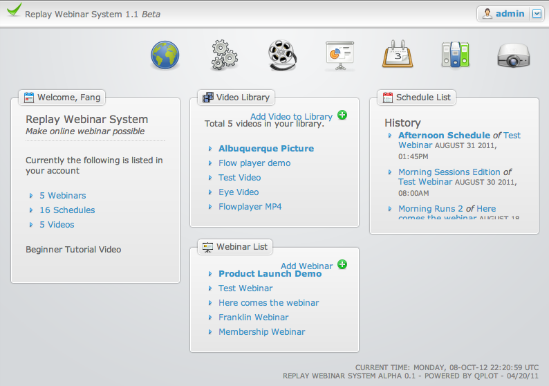

# Webinar Funnel

### Teryn Ashley Enterprises, Apr 2011 - Jan 2012
Lead UI / PHP Developer

Developed a webinar replay system of pre-recorded webinar that can be watched by invited users on preset (recurring) time. I was responsible for gathering business requirement and prototyping the UI design for business workflow. I also worked with an offshore *PHP* developer and we together coded frontend and backend logic for serving videos via *PHP* and *MySQL*.

**Project Manager / CakePHP Developer, Apr - 2011**

Simcard web application where public user can visit and choose the right sim card based on the cell phone carrier, plan type and montly cost. They can purchase the card after that. It's composed with two UI, one for the admin who can add new carrier plans and one for public user who can view and choose plans.

Here're list of key topics covered by this project.

| Topic        | Description    |
| ------------ | -------------- |
| Amazon S3    | Videos are uploaded and hosted with Amazon S3 for streaming efficiency |
| Video Replay | Videos can be replayed at specific time using flowplayer |
| Infusionsoft CRM | Integrated with Infusionsoft CRM API to use custom actions driving CRM |
| Roles / Permissions | Admin, customer and regular visitors |