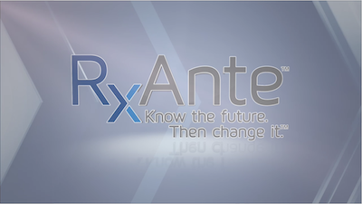
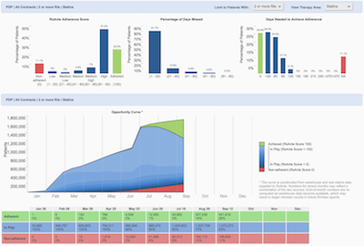
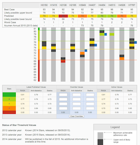

## RxAnte 

### RxAnte, Sep 2014 - Mar 2015
UI / Drupal Developer

Joined a second stage healthcare startup company working as a UI / *Drupal* developer. Provided enterprise Drupal development, support and deployment for a hospital/insurance/doctor relationship web application which helps their patients to adhere with their existing medications therefore upgrade ranking star in the healthcare system. I was responsive for refining Dashboard to present data collected from doctor office and insurance company and providing model prediction display of the patient behaviors. Analyzed data for each account (multi-tenant) are sampled from 10-20 contracts with average 0.5 to 5 millions patients.

### RxView

Provided enterprise PHP/Drupal development, support and deployment for a hospital/insurance/doctor relationship web application which helps their patients to adhere with their existing medications therefore upgrade ranking star in the healthcare system. The projects creates dashboard to present data collected from doctor office and insurance company and try to predict the patient behaviors. Analyzed data for **each account (multi-tenent) are sampled from 10-20 contracts with average 0.5 to 5 millions patients**.

| Dashboard     | Forecast      |
| ------------- | ------------- |
|  | 
| Present insurance company data | Predict based on existing data

Here is the list of key topics covered by this project,

| Topic        | Description    |
| ------------ |:-------------- |
| Drupal 7 | Drupal 7/MySQL deployed in centOS environment
| HIPPA Server | HIPPA for health care privacy with two factor VPN protections
| Continuous Integration | Local vagrant setup, continious integrated dev server and manual HIPPA production server
| Service API | Work with data team to formulate new and support old service API from data server
| Drupal Theming | Drupal theme and renderable array are extensively used for the embed business logic and workflow.
| Dashboard Design | Custom SVG chart component for various special crafted charts and tables
| Roles / Permissions | SSO access driven by external database | 
| Browser Compatibility | Browser compatibility support for Chrome, Safari,  Firefox and IE 8,9,10
| IE 8 Compatibility | Resolve background, round corner, table-cell, css compression issue

Some other minor highlights of the project includes,

