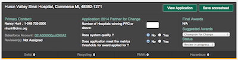
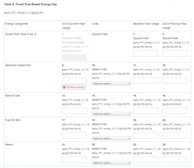
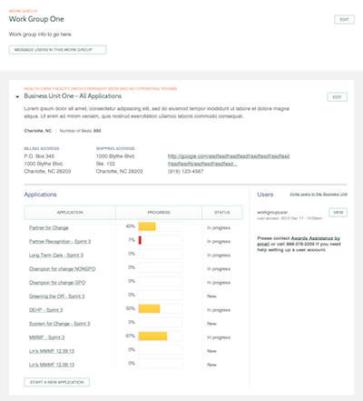

Practice Greenhealth Awards
=
**Leading role in architect and development**,
Nov 2013 - Apr 2014

In order for more accurately meanture and track sustainbility performance of hospitals, A Helth Care Assessment Tool that will allow members to assess and track sustainability accomplishments are developed. **320 awards (by 2013) are given to health care facilities and business members** that show achievement in varying levels of excellence in sustainability overt he course of the calendar year.  

| Forms     | Dashboard      |
| ------------- | ------------- |
|  |  |
| Multiple sections in each application | Application card summary |
|  |  |
| Questions in different layout | Application completion percentage |

The project evloves into discovery, phase I, phase II and deployment stages, and took 9 month and 2000 billable hours by a team with two developers (me as the lead) and one project manager. The site has been launched with **stats of 800,000 responses, 200 hospitals and 25,000 peek daily page views**.

Highlights:

| Topic        | Description    |
| ------------ |:-------------- |
| Drupal 7 | Drupal 7 and MySQL |
| Migration | Using Drupal migration module to handle large complicated dateset migration from legacy excel sheets |
| Salesforce Integration | Bidirectional sync between Drupal and Salesforce for customer account summary information |
| Organic Group | Organic-group like implementation when a member creates an application, 8000 quesitons (with empty answers) are auto-populated inside the application.   |
| Form API | Questions are organized in sections based on topic and are presented using Form API & renderable arrays with input type & data dynamically populated from database. The output format supports dropdown, pick list, checkbox or even Tables of other elements. |
| Dashboard Design | Due to large amount of the questions, the system shows applicant the percentage completion of the entire application and the percentage completion by selection in their dashboard. Each member can apply multiple application for different awards. |
| Review Workflow | Custom made review workflow where each application can be assigned a particular reviewer. Admin monitors a Reviewer Dashboard where you can assign, track and manage the review process. |
| Cron & Batch | Batch job is heavily used due to time consuming process of some key functionalities, ex. creating application, reporting generation etc. |
| Mathematic Formula | In order to reduce error, Excel cell kind calculation is implemented between questions, so if one question is answered, it'll populate another question in either the same or another section. |
| Score Management | Each question is assigned some set of point value. The system automatically calculates a total score for each application. Scores ae totaled for each section and are viiewable by reviewers as section score and % of attainable score in each topic area. |
| Report Export | Mass assignement with import andexport. |
| Content Type | Application, question, business unit etc. |
| Roles / Permissions | Admin, Manager, User |
| Browser Compatibility | IE 7,8,9, 38% of the user are using IE 7 and 96% are using Windows |