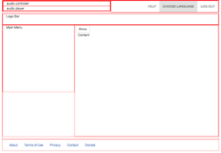
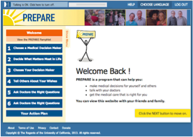

PeopleDesigns Prepare
=
**Leading role in architect and development**,
June - Oct 2014

| Wireframe     | Finished      |
| ------------- | ------------- |
|  |  |
| Wireframe design for various mobile devices | Book chapter with interactive content |

Provided [PrepareForYourCare](http://prepare2.peopledesigns.net) PHP/Laravel 4 architect, development and deployment for a hospital stage III counseling program to help people prepare the end of their life. The projects creates flexible tree-kind chapters navigation with video/narration helper for elder visits. The application has been used by **200 doctors and 50,000 users around the globe**.

| Topic        | Description    |
| ------------ |:-------------- |
| Laravel | Laravel 4.1 with MySQL deployed on CentOS |
| HIPPA Server | HIPPA server host and deployment plan protecting health care privacy |
| Authentication | Two factor SMS enabled authentication for better security protection |
| Password Recovery | Password can be recovered by either username or answer of least 3 of 6 questions in user profile |
| 508 section | Disability compliance with video, narration support for 90% of pages as well as large font and high contract color heading and text |
| Multilingual Support | Languages translation are made for pages (template based), snippets (element based) and graphics (text version), including english, spanish and chinese. |
| Responsive Design | Twitter Bootstrap is used for fast prototype with responsive design supporting desktop, ipad and other mobile devices |
| Template Design | Allow content manager to add/modify each page content (template/video/audio etc.) without touching database as well as code |
| File Management | Administer resource files through web interface, supports easy navigation between different content type and lanaguage pack.   |
| Content Type | User, Page, etc. |
| Roles / Permissions | Admin, Manager, User |
| Browser Compatibility | Browser compatibility support for Chrome, Safari,  Firefox and IE 8,9,10 |

Some other minor highlights of the project includes,

* Usage tracking: Track patient activity with visitors' book coverage
* Annonymous Usage: Allow annonymous user to have an account and adjust settings for the first time
* Admin: Allow admin to import and export data set from other server centers and merge/archive data
* User profile: Tabbed facebook-like profile with 100 fields and navigation between prev and next user

