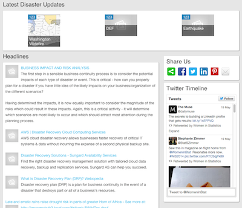

RecoveryHub
=
**Leading role in architect and deployment**,
Aug - Dec 2014

 

RecoveryHub with social media integration using Drupal Commons

Voluntarily provided Drupal 7 architect and deployment for [RecoveryHub](), which serves as a national (and potentially global) online network whose mission is to improve the lives of disaster survivors and enable community-led recovery.  For survivors and their communities, it provides a platform through which post-disaster needs can be matched with the goods and services – the recovery resources – made available to address those needs. 

Solr integration with custom layout

| Topic        | Description    |
| ------------ |:-------------- |
| Drupal 7 | Drupal 7 with MySQL
| Voluntary Project | Coordinate with project manager and group of volunteers and work on free time, ex. nights and weekends
| Deployment Plan | Re-featured and deployed all major pieces from scratch, then re-assembled together to form the new deployment plan using features, and custom script. 
| Solr Integration | Each drupal views are heavily relied on Solr  server integration, ex. server, index, fields and facets. All components are organized and committed using Features
| Organic Group | Drupal Commons has built-in organic group integration where we extend it our Organization and Disasters.
| Content Type | Organization, Disaster, Resource, Events etc.
